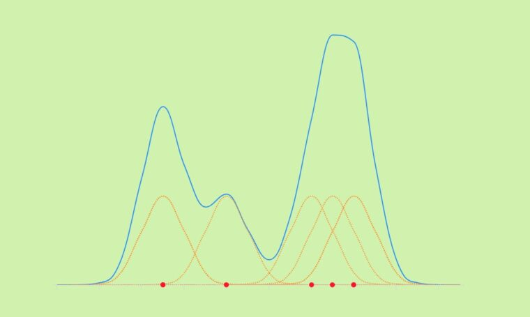
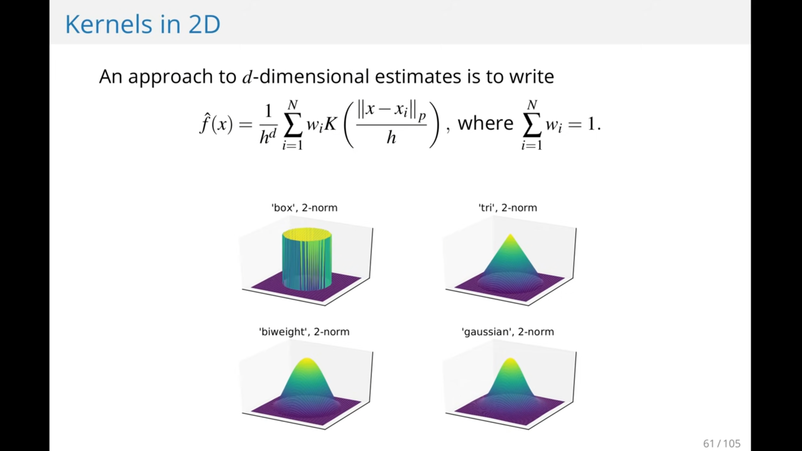
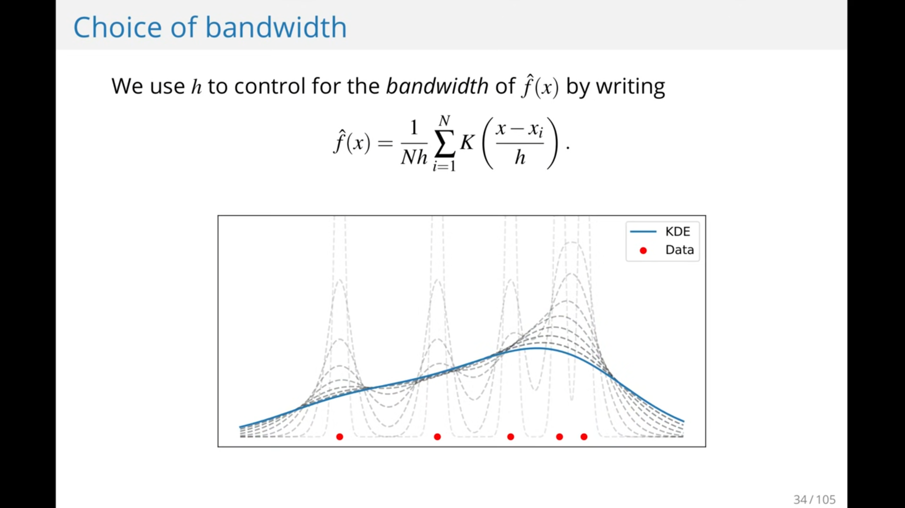

```{r setup, include=FALSE}
knitr::opts_chunk$set(echo = TRUE,  dev = "cairo_pdf")
```

# Preliminary Look at the data

We need first to define the data we have.   

| Variable | Definition                                    | Key                                            |
|:-------------------|:-------------------------|:-------------------------|
| survival | Survival                                      | 0 = No, 1 = yes                                |
| pclass   | ticket class                                  | 1 = 1st, 2 = 2nd, 3 = 3rd                      |
| sex      | sex                                           |                                                |
| age      | Age in year                                   |                                                |
| sibsp    | Number of siblings/spouses aboard the titanic |                                                |
| parch    | Number of parents/children aboard the Titanic |                                                |
| ticket   | ticket number(unique)                         |                                                |
| fare     | Passenger fare                                |                                                |
| cabin    | Cabin number                                  |                                                |
| embarked | port of embarkation                           | C = Cherbourg, Q = Queenstown, S = Southampton |
## Loading the packages and the Data 
```{r Loading Packages, echo=TRUE, message=FALSE, results='hide'}
# Loading Packages
library(tidyverse)
library(viridis)
library(ggplot2)
library(ggcorrplot)
library(ggthemes)
library(hrbrthemes)
library(e1071)
library(mice)
library(statsr)


# Loading Data
train <- read_csv("data/train.csv")
test <- read_csv("data/test.csv")
```

# Exploration Of The Data

## Description of the Data

## Summary of Data

```{r Data Summary}
summary(train)
```

Checking for Missing values in each feature
```{r Missing Values}
colSums(is.na(train))
```
## Categories of Features
### Qualitive 
Categorical: Survived, Sex, and Embarked.
Ordinal: Pclass.
Nominal: Name.
### Quantitive
Continous: Age, Fare.
Discrete: SibSp, Parch.
### Mix types
Ticket is a mix of numeric and alphanumeric data types
Cabin is mix between alpha and numeric
## Plotting The Data

### Correlation Matrix
We are going to use correlation matrix of the numerical data to assess the correlation, which might gives a better idea of which feature might be important
```{r Correlation Matrix,fig.height=4.5, fig.width=4.5,fig.align='center'}
correlationMatrix <- train %>%
  filter(!is.na(Age)) %>%
  select(Survived, Pclass,Age,SibSp,Parch,Fare) %>%
  cor() %>%
  ggcorrplot(lab = T,
             ggtheme =theme_ipsum_rc(grid = F),
             title="Correlation Matrix",hc.order=T,
             colors =rev(viridis(3,alpha=0.7)),
             digits = 1)

correlationMatrix
```

The fare features seems to be the most correlated feature to survival of the passengers, but it doesn't negate the importance of the other features in the data. Which means that we will start by comparing the each that we consider to be important against survival feature

### Class of Passenger
```{r PclassVSSurvived,fig.height=3.5, fig.width=3.5,fig.align='center'}
gPclassSurvived <- train %>%
  select(Pclass,Survived) %>%
  ggplot(aes(as_factor(Pclass),fill=as_factor(Survived))) + 
  geom_bar(position = "fill") +
  scale_y_continuous(labels=scales::percent) +
  theme_ipsum_rc() + 
  labs(x = "Classes",y = "Survival Rate")+
  scale_fill_discrete(name = "Survived", labels = c("Didn't Survive","Survived"))

gPclassSurvived
```

### Siblings and Spouses
```{r SibSpVSSurvived,fig.height=3.5, fig.width=3.5,fig.align='center'}
gSibSpSurvived <- train %>%
  select(SibSp,Survived) %>%
  ggplot(aes(as_factor(SibSp),fill=as_factor(Survived))) +
  geom_bar(position = "fill") + 
  scale_y_continuous(labels = scales::percent) +
  labs(x = "Siblings and Spouses",y = "Survival Rate")+
  scale_fill_discrete(name = "Survived", labels = c("Didn't Survive","Survived")) +
  theme_ipsum()

gSibSpSurvived
```

### Number of children/parents
```{r fig.height=3.5, fig.width=3.5,fig.align='center'}
gParchSurvived <- train %>%
  select(Parch,Survived) %>%
  ggplot(aes(as_factor(Parch),fill=as_factor(Survived))) + 
  geom_bar(position = "fill") +
  scale_y_continuous(label = scales::percent)+
  labs(x = "Number of parents/children",y = "Survival Rate")+
  scale_fill_discrete(name = "Survived", labels = c("Didn't Survive","Survived")) +
  theme_ipsum_rc()
gParchSurvived
```

### Gender VS Survived
```{r fig.height=3.5,fig.width=3.5,fig.align='center'}
gSexSurvived <- train %>%
  select(Sex,Survived) %>%
  ggplot(aes(as_factor(Sex),fill = as_factor(Survived))) + 
  geom_bar(position = "fill") +
  scale_y_continuous(label = scales::percent) + 
  labs(x = "Sex",y = "Survival Rate")+
  scale_fill_discrete(name = "Survived", labels = c("Didn't Survive","Survived")) +
  theme_ipsum_rc()
gSexSurvived
```

```{r}
gridExtra::grid.arrange(gPclassSurvived,
                        gSibSpSurvived,
                        gSexSurvived,
                        gParchSurvived,
                        nrow=2)
```

```{r}
train %>%
  group_by(Sex) %>%
  summarise(Age_mean = mean(Age,na.rm=TRUE),
            age_sd = sd(Age,na.rm=T),
            surival_mean = mean(Survived,na.rm =T),
            surival_sd = sd(Survived,na.rm = T))

```
# Description of the data
## Categorical Features
## Numerical Features

# kernel distribution

> A kernel distribution is a nonparametric representation of the probability density function  ($pdf$) of a random variable in any population 

The kernel smoothing function defines the shape of the curve used to generate the pdf 
Kernel distribution is Quote from histogram in other word (smooth representation of a histogram)
That the integral =1 
There is a benefit of smooth representation of a histogram like Ignores irregularities and outliers , more efficient in approximation so it deals better with large data than small data 

$$ \hat{f_h} = \frac{1}{n} = \sum^n_{i = 1} K(x-x_i)  = \frac{1}{nh} K\left(\frac{x-x_i}{h}\right) $$


## Rules

### Non-weighted Data
$$ \hat{f_h} = \frac{1}{n} \sum^n_{i = 1} K(x-x_i)  = \frac{1}{nh} K\left(\frac{x-x_i}{h}\right) $$

### Weighted Data

$$
\hat{f_h} = \frac{1}{h} \sum^N_{i=1} w_i K \left(\frac{x-x_i}{h}\right), \qquad \text{where} \sum^N_{i= 1} w_i  = 1
$$
 

 

 


## Kernel Function

1. Box
2. Triangle
3. Normal
4. Epanechnikov

Each density curve uses the same input data, but applies a different kernel smoothing function to generate the pdf. The density estimates are roughly comparable, but the shape of each curve varies slightly. For example, the box kernel produces a density curve that is less smooth than the others.

The choice of bandwidth value controls the smoothness of the resulting probability density curve
(higher value of h more smoothing )


Specifying a smaller bandwidth produces a very rough curve, but reveals that there might be two major peaks in the data. Specifying a larger bandwidth produces a curve nearly identical to the kernel function 
Choosing the optimal (h) bandwidth methods :
1-	Silverman’s rule of thump that computes an optimal h by assuming that data is normally distributed 
2-	Improved Sheather jones (ISJ) an algorithm is more robust with multimodality data or a lot of data (one disadvantage is it needs to large data )


Bounded domains data : have a constrains like data couldn’t be negative ( -ve lead to probability = 0)
Mirror method
1-	Mirror the data 
2-	Sum the original and mirrored kernel density estimate
3-	Chop it so that zero at the boundary side 

2D : 

h : could be matrix (different h in different directions )
the choice of norm comes into d>=2
the p-norm is  $||x||_p := (\sum_{i=1} |x|^p)^{\frac{1}{p}}$
  norm-p =1    manhattan distance
  norm-p =2    ecludian norm
  
  norm-p =inf   maximum norm
(it’s not abvious in every case which norm is the correct one)

standard euclidean distance is good choice because it invariant under rotation 
as large data choice of k and p isn’t important so 

