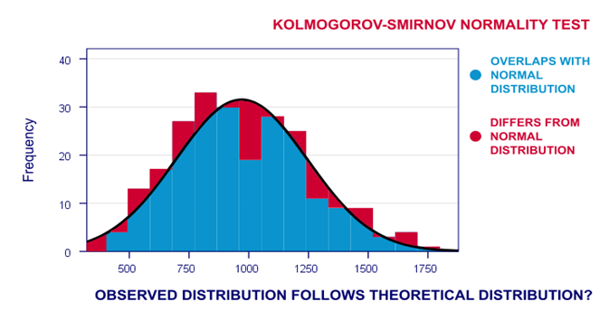
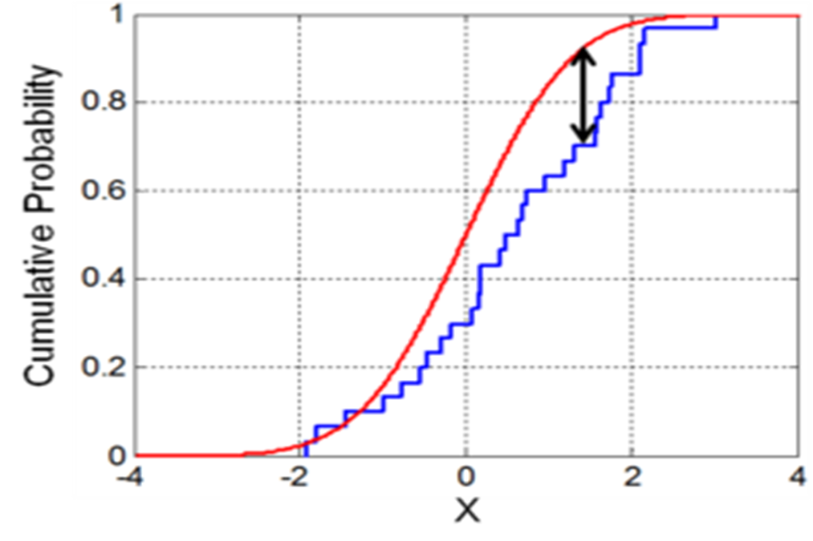

# Introduction

In this project we are trying first to explore our data to get a better
understanding To answer our questions we first need to have a
preliminary look at our data, so that we can get a better a idea what we
are dealing with, as well as the possible missing data and relationships
that exist

## Preliminary Look at the data

We need first to define the data we have.

| Variable | Definition                                    | Key                                             |
|:---------|:----------------------------------------------|:------------------------------------------------|
| survival | Survival                                      | 0 = No, 1 = yes                                 |
| pclass   | ticket class                                  | 1 = 1st, 2 = 2nd, 3 = 3rd                       |
| sex      | sex                                           |                                                 |
| age      | Age in year                                   |                                                 |
| sibsp    | Number of siblings/spouses aboard the titanic |                                                 |
| parch    | Number of parents/children aboard the Titanic |                                                 |
| ticket   | ticket number(unique)                         |                                                 |
| fare     | Passenger fare                                |                                                 |
| cabin    | Cabin number                                  |                                                 |
| embarked | port of embarkation                           | C = Cherbourg, Q = Queens-town, S = Southampton |

## Loading the packages and the Data

```{r Loading Packages, echo=TRUE, message=FALSE, results='hide'}
# Loading Packages
## tidyverse loads dplyr and readr
library(tidyverse)

## To have different color maps
library(viridis)

## ggplot2 to produce different plots
library(ggplot2)

## uses ggplot2 to produce a correlation matrix -- the data must be in the correct form
library(ggcorrplot)

## Gives us better themes
library(hrbrthemes)

## to use skewness fun. to calculate skewness of the distribution
library(e1071)

## Multivariate imputation using chained equations -- to impute the missing values in our data
library(mice)

## Loads different statistical functions
library(statsr)

## To produce interactive plot
library(plotly)

## To use bias function
library(Metrics)


# Loading Training Data
train <- read_csv("data/train.csv")

# Loading Testing Data
test <- read_csv("data/test.csv")

# Binding them into a full data frame
df <- bind_rows(train,test)
```

# Exploration Of The Data

## Summary of Data

```{r Data Summary}
summary(train)
```

## Categories of Features

> Quantitative data are measures of values or counts and are expressed
> as numbers.

> Qualitative data are measures of 'types' and may be represented by a
> name, symbol, or a number code.

### Qualitive

Categorical: Survived, Sex, and Embarked. Ordinal: Pclass. Nominal:
Name.

### Quantitive

Continuous: Age, Fare. Discrete: SibSp, Parch.

### Mix types

Ticket is a mix of numeric and alphanumeric data types Cabin is mix
between alpha and numeric

## Exploring Missing Data.

Checking for Missing values in each feature

```{r Missing Values}
colSums(is.na(train))
```

```{r Missing values plot}
missing_values <- train %>% summarize_all(funs(sum(is.na(.))/n()))

missing_values <- gather(missing_values, key="feature", value="missing_pct")

missing_values

missing_values %>% 
  ggplot(aes(x=reorder(feature,-missing_pct),y=missing_pct)) +
  geom_bar(stat="identity",fill="red") +
  coord_flip() + # to flip the graph
  xlab("Features") +
  ylab("Percentage of missing values")+
  scale_y_continuous(labels=scales::percent) +
  theme_ipsum()
```

### Missing data, it is normal?

It is quite normal to see missing data in any data-set as such data is
collected by manually which means that there might be some error.
Missing data present various problems. First, the absence of data
reduces statistical power, which refers to the probability that the test
will reject the null hypothesis when it is false. Second, the lost data
can cause bias in the estimation of parameters. Third, it can reduce the
representativeness of the samples.

### The solution to the missing data

#### Removal

The removal of the observations that contain missing might cause a
bigger issue where it might an even bigger loss of information which
cause bias in our estimation. But on close observation of our data we
can identify that there are some features that are not extremely useful
and contain missing data, so we can drop such features.

```{r droping cabin}
train <- train %>%
  select(!Cabin)
summary(train)
```

#### Imputation

Imputing the missing data gives the advantage that we use a learning
model to predict such missing data and maintain the distribution of our
data.

## Histogram of Age feature.

```{r Age histogram}
gAgeDensity <- train %>%
  select(Age) %>%
  ggplot(aes(Age, y = ..density..)) +
  geom_histogram(bins = 20,binwidth = 1,color=inferno(1,alpha=1)) + 
  geom_density(fill=inferno(1,begin = 0.5,alpha = 0.5),color = inferno(1,begin=0)) + 
  annotate(
    "text",
    x = 70,
    y = 0.04,
    label = paste("Skewness:",skewness(train$Age,na.rm = T)),
    colour = inferno(1,begin = 0.1),
    size = 4
  ) + 
  theme_ipsum_rc()

gAgeDensity
```

### Population mean and standard deviation of Age feature Before imputation

```{r Summary of Age feature}
train %>%
  summarise(Age_mean = mean(Age,na.rm = T), Age_sd = sd(Age,na.rm = T))
```

## Histogram of Fare feature

```{r Histogram of Fare Feature}
gFareDensity <- train %>%
  select(Fare) %>%
  ggplot(aes(Fare, y = ..density..)) +
  geom_histogram(bins = 20,binwidth = 1,color=viridis(1,alpha=1)) + 
  geom_density(fill=inferno(1,begin = 0.5,alpha = 0.5),color = viridis(1,begin=0)) + 
  scale_y_continuous(limits = c(0,0.05))+
  theme_ipsum_rc() + 
  annotate(
    "text",
    x = 200,
    y = 0.05,
    label = paste("Skewness",skewness(train$Fare)),
    colour = "black",
    size = 4
  )

gFareDensity 
```

### Population mean and standard deviaiton of Fare feature.

```{r Summary of Fare Feature}
train %>%
  summarise(Fare_mean = mean(Fare,na.rm = T), Fare_sd = sd(Fare,na.rm = T))
```

## Imputing the missing age feature

### Correlation matrix before imputation

We are going to use correlation matrix of the numerical data to assess
the correlation, which might gives a better idea of which feature might
be important

The fare features seems to be the most correlated feature to survival of
the passengers, but it doesn't negate the importance of the other
features in the data. Which means that we will start by comparing the
each that we consider to be important against survival feature

We will print it once before imputation and the second time after imputation of our data to see an aspect of the data imputation

```{r Correlation Matrix 1, fig.align='center'}
correlationMatrix <- train %>%
  filter(!is.na(Age)) %>%
  select(Survived, Pclass,Age,SibSp,Parch,Fare) %>%
  cor() %>%
  ggcorrplot(lab = T,
             ggtheme =theme_ipsum_rc(grid = F),
             title="Correlation Matrix",hc.order=T,
             colors =rev(viridis(3,alpha=0.7)),
             digits = 1)

correlationMatrix
```

### Imputation

```{r Imputation}
#---------------MICE--------------
set.seed(129)
mice_mod <- mice(train[,!names(train) %in% c('PassengerId','Name','Ticket','Cabin','Survived')],method = 'rf')
mice_output <- complete(mice_mod)

gdistrOriginalData <- train %>%
  select(Age) %>%
  ggplot(aes(Age, y = ..density..)) +
  geom_histogram(bins = 25,binwidth = 1,color=inferno(1,alpha=1)) + 
  geom_density(fill=inferno(1,begin = 0.5,alpha = 0.5),color = inferno(1,begin=0)) +
  ggtitle("Distribution of original data") +
  theme_ipsum_rc()
gdistrMICEData <- mice_output %>%
  select(Age) %>%
  ggplot(aes(Age, y = ..density..)) +
  geom_histogram(bins = 25,binwidth = 1,color=inferno(1,alpha=1)) + 
  geom_density(fill=inferno(1,begin = 0.5,alpha = 0.5),color = inferno(1,begin=0)) + 
  ggtitle("Distribution of mice output") +
  theme_ipsum_rc()

gridExtra::grid.arrange(gdistrOriginalData,gdistrMICEData,nrow = 1)

train$Age <- mice_output$Age

missing_values <- train %>% summarize_all(funs(sum(is.na(.))/n()))

missing_values <- gather(missing_values, key="feature", value="missing_pct")

missing_values

missing_values %>% 
  ggplot(aes(x=reorder(feature,-missing_pct),y=missing_pct)) +
  geom_bar(stat="identity",fill="red") +
  coord_flip() + # to flip the graph
  xlab("Features") +
  ylab("Percentage of missing values")+
  scale_y_continuous(labels=scales::percent) +
  theme_ipsum()
```
### Correlation matrix after imputation

```{r Correlation Matrix 2, fig.align='center'}
correlationMatrix <- train %>%
  filter(!is.na(Age)) %>%
  select(Survived, Pclass,Age,SibSp,Parch,Fare) %>%
  cor() %>%
  ggcorrplot(lab = T,
             ggtheme =theme_ipsum_rc(grid = F),
             title="Correlation Matrix",hc.order=T,
             colors =rev(viridis(3,alpha=0.7)),
             digits = 1)

correlationMatrix
```

### Population mean and standard deviation

```{r Summary of Age feature After Imputation}
train %>%
  summarise(Age_mean = mean(Age,na.rm = T), Age_sd = sd(Age,na.rm = T))
```

## Determining the distrubutuion of Age and Fare By inspection

Though determination of the distribution using inspection is likely not
going to be effective we are going to the KS-test in a later section

### Age

The histogram of the Age feature look very much like a normal
distribution, yet it's not a normal distribution itself.

### Fare

The histogram of the Fare feature fits the $\chi^2$ distribution.

## Plotting The Data

We include even more plots of our data to get a better understanding of
it, help us see hidden correlations and ways to facilitate our analysis

### Class of Passenger Vs Survived

```{r PclassVSSurvived,fig.align='center'}
gPclassSurvived <- train %>%
  select(Pclass,Survived) %>%
  ggplot(aes(as_factor(Pclass),fill=as_factor(Survived))) + 
  geom_bar(position = "fill") +
  scale_y_continuous(labels=scales::percent) +
  theme_ipsum_rc() + 
  labs(x = "Classes",y = "Survival Rate")+
  scale_fill_discrete(name = "Survived", labels = c("Didn't Survive","Survived"))

gPclassSurvived
```

From this Plot, it seems clear that people from the upper classes had higher survival rates, thought this seemed obvious from the beginning.

### Siblings and Spouses Vs Survived

```{r SibSpVSSurvived,fig.align='center'}
gSibSpSurvived <- train %>%
  select(SibSp,Survived) %>%
  ggplot(aes(as_factor(SibSp),fill=as_factor(Survived))) +
  geom_bar(position = "fill") + 
  scale_y_continuous(labels = scales::percent) +
  labs(x = "Siblings and Spouses",y = "Survival Rate")+
  scale_fill_discrete(name = "Survived", labels = c("Didn't Survive","Survived")) +
  theme_ipsum()

gSibSpSurvived
```

This plot highlight a point that might be counter-intuitive that people that have no siblings or spouses had lower survival rates than those with at least one sibling or a spouse

### Number of children/parents Vs Survived

```{r fig.align='center'}
gParchSurvived <- train %>%
  select(Parch,Survived) %>%
  ggplot(aes(as_factor(Parch),fill=as_factor(Survived))) + 
  geom_bar(position = "fill") +
  scale_y_continuous(label = scales::percent)+
  labs(x = "Number of parents/children",y = "Survival Rate")+
  scale_fill_discrete(name = "Survived", labels = c("Didn't Survive","Survived")) +
  theme_ipsum_rc()
gParchSurvived
```

### Gender VS Survived

```{r fig.align='center'}
gSexSurvived <- train %>%
  select(Sex,Survived) %>%
  ggplot(aes(as_factor(Sex),fill = as_factor(Survived))) + 
  geom_bar(position = "fill") +
  scale_y_continuous(label = scales::percent) + 
  labs(x = "Sex",y = "Survival Rate")+
  scale_fill_discrete(name = "Survived", labels = c("Didn't Survive","Survived")) +
  theme_ipsum_rc()
gSexSurvived
```
### Survival Density and Age
```{r}
gSurvivalAgeDensity <- ggplot(train[(!is.na(train$Survived) & !is.na(train$Age)),],
            aes(x = Age,
                fill = Survived)) +
  geom_density(alpha=0.5,
               aes(fill=as_factor(Survived))) +
  labs(title="Survival density and Age") +
  scale_x_continuous(breaks = scales::pretty_breaks(n = 10)) +
  theme_ipsum()

gSurvivalAgeDensity
```

### Dashboard of the previous graphs

```{r}
gridExtra::grid.arrange(gPclassSurvived,
                        gSibSpSurvived,
                        gSexSurvived,
                        gParchSurvived,
                        gSurvivalAgeDensity,
                        nrow=3)
```

```{r}
train %>%
  group_by(Sex) %>%
  summarise(Age_mean = mean(Age,na.rm=TRUE),
            age_sd = sd(Age,na.rm=T),
            surival_mean = mean(Survived,na.rm =T),
            surival_sd = sd(Survived,na.rm = T))

```

## Sampling

### Random sample of size of 50 (Age)

```{r Sampling-1}
sample_50 <- sample_n(train,size = 50,replace = T) %>%
  summarise(mean = mean(Age), sd = sd(Age))
sample_50
```
### Sampling distrubution with a fixed size (50) (mean)
```{r}
numOfSamples <- seq(50,1000,50)

smplngDstrbtnRpsChng <- tibble()

for(i in numOfSamples){
  
  for(y in 1:i){
    nsample <- sample_n(train,size=50,replace=T) %>%
      select(Age)
    newRow <- nrow(smplngDstrbtnRpsChng) + 1
    smplngDstrbtnRpsChng[newRow,"reps"] <- i
    smplngDstrbtnRpsChng[newRow,"x_bar"] <- mean(nsample$Age,na.rm = T)
  }
  
}

gSamplingReps <- smplngDstrbtnRpsChng %>%
  plot_ly(
    x = ~x_bar,
    frame = ~reps,
    type = "histogram"
  )
gSamplingReps
```

While no. of sample size increase the variability of sampling
distribution decrease and the mean increase.

### Sampling distribution with a fixed repetitions and different sizes (mean)

```{r sampling-distrubution-sizes}
sizes <- seq(20,260,20)
smplngDstrbtnSzChng <- tibble()
for(i in sizes){
  for(y in 1:1500){
    nsample <- sample_n(train,size=i,replace=T) %>%
      select(Age)
    newRow <- nrow(smplngDstrbtnSzChng) + 1
    smplngDstrbtnSzChng[newRow,"sizes"] <- i
    smplngDstrbtnSzChng[newRow,"x_bar"] <- mean(nsample$Age,na.rm = T)
  }
}
gSamplingSize <- smplngDstrbtnSzChng %>%
  plot_ly(
    x = ~x_bar,
    frame = ~sizes,
    type = "histogram"
  )
gSamplingSize
```

While no. of sample size increase the variability of sampling
distribution decrease,and The sample distribution mean will be normally
distributed as long as the sample size is more than 30.

### sampling distribution of variance with different sizes and fixed repitions.

```{r}
sizes <- c(2,20,25,30,35,40,45,50)
smplngDstrbtnSzChngVariance <- tibble()
for(i in sizes){
  for(y in 1:1500){
    nsample <- sample_n(train,size=i,replace=T) %>%
      select(Age)
    newRow <- nrow(smplngDstrbtnSzChngVariance) + 1
    smplngDstrbtnSzChngVariance[newRow,"sizes"] <- i
    smplngDstrbtnSzChngVariance[newRow,"variance"] <- sd(nsample$Age,na.rm = T)**2
  }
}
gSamplingSizeVariance <- smplngDstrbtnSzChngVariance %>%
  plot_ly(
    x = ~variance,
    frame = ~sizes,
    type = "histogram"
  )
gSamplingSizeVariance
```

## MME and MLE

$$ M_1 = E(x) = \frac{1}{n} \sum^{n}_{i = 1} x_i $$
$$ M_2 = E(x^2) = \sigma^2 + (E(x))^2 = \frac{1}{n} \sum^{n}_{i = 1} {x_i}^2 $$
$$ \mu = \frac{1}{2} \sum^{n}_{i =1} x_i = M_1 $$
$$ \sigma^2 = E(x^2) - (E(x))^2 = \frac{1}{n} \sum^{n}_{i=1} {x_i}^2 - \left( \frac{1}{n} \sum^{n}_{i = 1} x_i \right)^2 $$

### Size 50
```{r}
# Sampling
n_size = 50
nsample <- sample_n(train,size=n_size,replace=T)
# MME
mean_est1=sum(nsample$Age) / n_size
var_est1 = (sum(nsample$Age^2) / n_size) - (mean_est1)^2
mean_est1
var_est1
bias(actual = mean(train$Age,na.rm = T), predicted = mean_est1)
# MLE
NLL = function(pars,data){
  # Extract parameters from the vector
  mu = pars[1]
  sigma = pars[2]
  NLL = -sum(dnorm(x = data , mean = mu, sd = sigma , log = TRUE))
  # Log of pdf
  # negative to get max
}
mle <- optim(par = c(mu= .2 , sigma = 1.5),fn=NLL,data=nsample$Age,control = list(parscale=c(mu= .2 , sigma = 1.5)))
mle$par[1]

bias(actual = mean(train$Age,na.rm = T), predicted = mle$par[1])
```

### Size 200
```{r}
# Sampling
n_size = 200
nsample <- sample_n(train,size=n_size,replace=T)
# MME
mean_est1=sum(nsample$Age) / n_size
var_est1 = (sum(nsample$Age^2) / n_size) - (mean_est1)^2
mean_est1
var_est1
bias(actual = mean(train$Age,na.rm = T), predicted = mean_est1)
# MLE
NLL = function(pars,data){
  # Extract parameters from the vector
  mu = pars[1]
  sigma = pars[2]
  NLL = -sum(dnorm(x = data , mean = mu, sd = sigma , log = TRUE))
  # Log of pdf
  # negative to get max
}
mle <- optim(par = c(mu= .2 , sigma = 1.5),fn=NLL,data=nsample$Age,control = list(parscale=c(mu= .2 , sigma = 1.5)))
mle$par[1]

bias(actual = mean(train$Age,na.rm = T), predicted = mle$par[1])
```
## Male Age - Female Age
```{r}
age_male <- train %>%
  select(Age,Sex) %>%
  mutate(Sex = as_factor(Sex)) %>%
  filter(Sex == "male")
age_female <- train %>%
  select(Age,Sex) %>%
  mutate(Sex = as_factor(Sex)) %>%
  filter(Sex == "female")

sample_age_male_50 <- age_male %>%
  rep_sample_n(size = 50,reps = 15000,replace = T) %>%
  summarise(age_male_bar = mean(Age,na.rm = T))
sample_age_female_50 <- age_female %>%
  rep_sample_n(size = 50,reps = 15000,replace = T) %>%
  summarise(age_female_bar = mean(Age,na.rm = T))

samplediff_means <- sample_age_male_50$age_male_bar -  sample_age_female_50$age_female_bar %>%
  as_tibble()

gsamplediff_means <- samplediff_means %>%
  ggplot(aes(value, y = ..density..)) +
  geom_histogram(bins = 25,binwidth = 1,color=inferno(1,alpha=1)) + 
  geom_density(fill=inferno(1,begin = 0.5,alpha = 0.5),color = inferno(1,begin=0)) +
  ggtitle("Distribution") +
  theme_ipsum_rc()
gsamplediff_means
```

## Survived Male - Survived Female

```{r}
survived_male <- train %>%
  select(Survived,Sex) %>%
  filter(Sex == "male")

survived_female <- train %>%
  select(Survived,Sex) %>%
  filter(Sex == "female")

sample_survive_male_50 <- survived_male %>%
  rep_sample_n(size = 50,reps = 15000,replace = T)
sample_survive_female_50 <- survived_female %>%
  rep_sample_n(size = 50,reps = 15000,replace = T)
samplediff_survived <- sample_survive_male_50$Survived - sample_survive_female_50$Survived %>% 
  as_tibble()

gsamplediff_survived <- samplediff_survived %>%
  ggplot(aes(value)) +
  geom_histogram(bins = 25,binwidth = 1,color=inferno(1,alpha=1)) + 
  ggtitle("Distribution") +
  theme_ipsum_rc()
gsamplediff_survived
```

The plot is a bit hard to understand so it needs a bit of explanation. $-1$ represents the female survived, $0$ represents the neither of them survived, and $1$ means that the male survived

After inspecting the plot, it becomes Crystal clear that there was a bias in the rescue process where rescuers preferred to save female more than males.

## Confidence Intervals
```{r}
n_size = 10
nsample <- sample_n(train,size= n_size,replace=T)

# Calculate The Mean
mean_est1=mean(nsample$Age,na.rm = T)

# Calculate The Standard Deviation
sd_est1=sd(nsample$Age,na.rm = T)

# Computing The Error Using the qnorm() Function to Calculate The Normal Distribution 
error=qt(0.975,df = 9, lower.tail = T)*(sd_est1/sqrt(n_size)) # at lower.tail = T probability is P[X<=x] , otherwise P[X>x]

#Determining The Mean Interval[]
left <- mean_est1-error
right <- mean_est1+error

print(paste0("[",left,",",right,"]"))
```

```{r}
n_size = 50
nsample <- sample_n(train,size=n_size,replace=T)

# Calculate The Mean
mean_est2=mean(nsample$Age,na.rm = T)

# Calculate The Standard Deviation
sd_est2=sd(nsample$Age,na.rm = T)

# Computing The Error Using the qnorm() Function to Calculate The Normal Distribution 
error=qnorm(0.975)*(sd_est1/sqrt(n_size))

#Determining The Mean Interval[]
left <- mean_est2-error
right <- mean_est2+error

print(paste0("[",left,",",right,"]"))
```
## Multiplication and addition of constant to the sample values

### Multiplication

```{r}
n_size = 200

nsample <- sample_n(train,size = n_size,replace = T)

nsample %>%
  summarise(Age_mean = mean(Age), Age_sd = sd(Age),Age_var = sd(Age)^2)

nsample$Age <- nsample$Age *5
nsample %>%
  summarise(Age_mean = mean(Age), Age_sd = sd(Age),Age_var = sd(Age)^2)

```
### Addition

```{r}
n_size = 200

nsample <- sample_n(train,size = n_size,replace = T)

nsample %>%
  summarise(Age_mean = mean(Age), Age_sd = sd(Age),Age_var = sd(Age)^2)

nsample$Age <- nsample$Age + 5
nsample %>%
  summarise(Age_mean = mean(Age), Age_sd = sd(Age),Age_var = sd(Age)^2)

```

# kernel distribution

> A kernel distribution is a nonparametric representation of the
> probability density function ($pdf$) of a random variable in any
> population

The kernel smoothing function defines the shape of the curve used to
generate the pdf Kernel distribution is Quote from histogram in other
word (smooth representation of a histogram) That the integral =1 There
is a benefit of smooth representation of a histogram like Ignores
irregularities and outliers , more efficient in approximation so it
deals better with large data than small data

$$ \hat{f_h} = \frac{1}{n} = \sum^n_{i = 1} K(x-x_i)  = \frac{1}{nh} K\left(\frac{x-x_i}{h}\right) $$

## Rules

### Non-weighted Data

$$ \hat{f_h} = \frac{1}{n} \sum^n_{i = 1} K(x-x_i)  = \frac{1}{nh} K\left(\frac{x-x_i}{h}\right) $$

### Weighted Data

$$
\hat{f_h} = \frac{1}{h} \sum^N_{i=1} w_i K \left(\frac{x-x_i}{h}\right), \qquad \text{where} \sum^N_{i= 1} w_i  = 1
$$

## Kernel Function

1. Box
2. Triangle
3. Normal
4. Pantechnicon

Each density curve uses the same input data, but applies a different
kernel smoothing function to generate the pdf. The density estimates are
roughly comparable, but the shape of each curve varies slightly. For
example, the box kernel produces a density curve that is less smooth
than the others.

The choice of bandwidth value controls the smoothness of the resulting
probability density curve (higher value of $h$ more smoothing)

Specifying a smaller bandwidth produces a very rough curve, but reveals
that there might be two major peaks in the data. Specifying a larger
bandwidth produces a curve nearly identical to the kernel function
Choosing the optimal ($h$) bandwidth methods :

1. Silverman's rule of thump that computes an optimal h by assuming
    that data is normally distributed
2. Improved Sheather Jones (ISJ) an algorithm is more robust with
    multimodality data or a lot of data (one disadvantage is it needs to
    large data )

Bounded domains data: have a constrains like data couldn't be negative (
-ve lead to probability = 0)

## Mirror method

1.  Mirror the data
2.  Sum the original and mirrored kernel density estimate
3.  Chop it so that zero at the boundary side

## 2D

$h$ : could be matrix (different $h$ in different directions)

The choice of norm comes into $d \ge 2$

The p-norm is $||x||_p := (\sum_{i=1} |x|^p)^{\frac{1}{p}}$ - norm-p =1
Manhattan distance - norm-p =2 Euclidean norm - norm-p =inf maximum norm
(it's not obvious in every case which norm is the correct one)

standard euclidean distance is good choice because it invariant under
rotation as large data choice of k and p isn't important so

# Kolmogorov-Smirnov Test

> Non parametric test

Kolmogorov-Smirnov Test is used to:
1. Decide if a sample comes from a population with an expected continuous distribution (mostly normal distribution)
2. To test for the difference in the shape of two sample distributions



Compare overall shape of distribution, not specifically parameter

Kolmogorov-Smirnov Test is defined by a hypothesis: 
$H_0$ : the data follow specific distribution $F(x) = F_T (x)$
$H_a$ : the data don't follow specific distribution  $F(x) \neq F_T (x)$

KS-test is made between some theoretical cumulative distribution function ($F_T(x)$), and a sample cumulative distribution function ($F_s(x)$) that measured by the statistic D, which is the greatest vertical distance between them.
$$ D = \underbrace{\text{sup}}_{x} | F_s(x) - F_t (x)|$$


1. Determine $x$ values
2. Detemrine frequency of each observation
3. Calculate cumulative frequency
4. Calculate $F_s(x) \rightarrow \frac{\text{cumulative frequence}}{N}$ when $n > 30$ ($z$-scores), when $n<30$ ($t$-scores)
5. calculate $F_t(x)$
6. Calculate $D \rightarrow F_s(x) - F_T(x)$
7. Choose maximum $D$
8. Calculate $P$-value
9. Determine Kolmogorov's quartile
10. Compare $p$-value with Kolmogorove's quartile